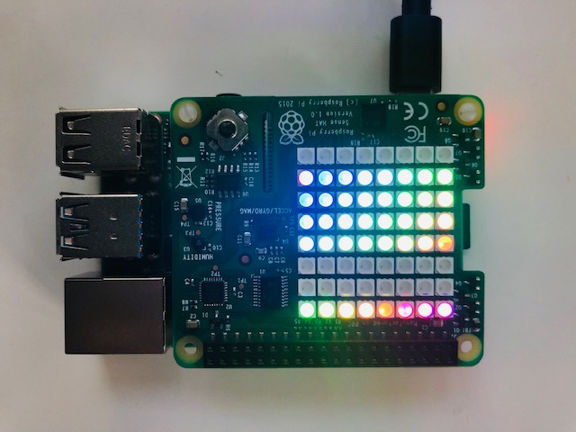

# Raspberry Pi Wake Word Detection with Sense Hat

_This repository is part of the Twitch series, "Voice + Robotics", found at [https://twitch.tv/amazonalexa/](https://twitch.tv/amazonalexa)._

Following this code will allow you to create a connection between an Amazon Echo device that is paired via BlueTooth to a Raspberry Pi. 
This is heavily based off of the [Alexa Gadgets Raspberry Pi Wake Word](https://github.com/alexa/Alexa-Gadgets-Raspberry-Pi-Samples/tree/master/src/examples/wakeword) sample, but updated to work with a [Sense Hat](https://www.raspberrypi.org/products/sense-hat/).

The Sense Hat provides an 8x8 LED matrix and sensors like an accelerometer, gyroscope, and more. The LED matrix will be used to show the succesful connection between the Raspberry Pi and Echo.

You will need:

* A Raspberry Pi (3 and above)
* [Sense Hat](https://www.raspberrypi.org/documentation/hardware/sense-hat/) 

## Steps

### Register your gadget

Follow the instructions in [Register a Gadget](https://github.com/alexa/Alexa-Gadgets-Raspberry-Pi-Samples/blob/master/README.md#registering-a-gadget-in-the-alexa-voice-service-developer-console) to register your gadget with the Alexa Voice Service (AVS) using the developer portal.

- Take note of your Amazon ID and Alexa Gadget Secret when you've completed the initial setup

### Setup Your Raspberry Pi

You'll first want to setup your Raspberry Pi with the [latest version of Raspbian](https://www.raspberrypi.org/downloads/raspbian/). 

Then, you'll need to install the Alexa Gadgets Toolkit. The easiest way to setup the Alexa Gadgets Toolkit is to clone the sample repo at [https://github.com/alexa/Alexa-Gadgets-Raspberry-Pi-Samples](https://github.com/alexa/Alexa-Gadgets-Raspberry-Pi-Samples) and follow the instructions to configure your Raspberry Pi and register it as a gadget. 

## Code for your Raspberry Pi

You'll need two files on your Raspberry Pi for this to work, which can be found in the `device` folder. Change the values of `wakeword-sample.ini` to match those that you took note of when you registered your gadget. Then, change the filename to `wakeword.ini`.

From you terminal, run

    python3 wakeword.py
    
You should see something similar to:

    Attempting to pair/connect
    INFO:agt.alexa_gadget:Attempting to reconnect to Echo device with address: 74:C2:46:CE:22:11

Then, invoke Alexa and watch your Sense Hat light up: __"Alexa, what time is it?"__

## Resources

- [https://github.com/alexa/Alexa-Gadgets-Raspberry-Pi-Samples](https://github.com/alexa/Alexa-Gadgets-Raspberry-Pi-Samples)
- [Bluetooth Commands](https://www.raspberrypi.org/forums/viewtopic.php?t=214373)
- [https://github.com/alexa/Alexa-Gadgets-Raspberry-Pi-Samples/tree/master/src/examples/colorcycler](https://github.com/alexa/Alexa-Gadgets-Raspberry-Pi-Samples/tree/master/src/examples/colorcycler)
